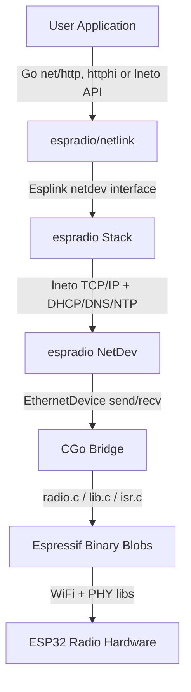

# espradio

[](https://pkg.go.dev/tinygo.org/x/espradio) [](https://github.com/tinygo-org/espradio/actions/workflows/build.yml)

[TinyGo](https://tinygo.org/) package for wireless communication on [Espressif](https://www.espressif.com/) ESP32xx microcontrollers.

Currently supports WiFi on the following processors:

- [`esp32`](https://www.espressif.com/en/products/socs/esp32) dual-core XTensa LX6 MCU. 
- [`esp32c3`](https://www.espressif.com/en/products/socs/esp32-c3) single-core 32-bit RISC-V MCU
- [`esp32s3`](https://www.espressif.com/en/products/socs/esp32-s3) dual-core XTensa LX7 MCU. 

Bluetooth is in progress, along with more processors.

## Features

- WiFi station (STA) and soft-AP modes
- WiFi scanning
- ESP-NOW peer-to-peer messaging, no access point or TCP/IP needed
- Go stdlib `net` support using the TinyGo `netdev`/`netlink` interface
- Pure-Go TCP/IP stack with DHCP, DNS, and NTP (uses [`lneto`](https://github.com/soypat/lneto))
- Heapless HTTP/1.1 server that allocates nothing per request (uses [`httphi`](https://github.com/soypat/lneto/tree/main/http/httphi)). See examples []
- TCP and UDP Berkeley sockets API
- Raw Ethernet frame send/receive
- MQTT client support (uses [`natiu-mqtt`](https://github.com/soypat/natiu-mqtt))
- QEMU simulation target for ESP32-C3
- net/http availability for HTTP/2 support. Not recommended for long running programs. See [examples README](./examples/README.md#http-stdlib).

## Getting started with HTTP `hello` example
We can start a basic HTTP webserver on the [Seeed Studio XIAO-ESP32C3](https://www.seeedstudio.com/Seeed-XIAO-ESP32C3-p-5431.html) using espradio along with the lightweight [`httphi`](https://github.com/soypat/lneto/tree/main/http/httphi) library using the code below. See [the example for all the code](./examples/http-hello/main.go):

```go
func main() {
	// use ESP32 radio
	link := &link.Esplink{}
	netdev.UseNetdev(link)

	println("Connecting to WiFi...")
	failIfErr("connect", link.NetConnect(&nl.ConnectParams{
		Ssid:       ssid,
		Passphrase: password,
	}))

	println("Connected to WiFi.")
	var http httphi.MuxSlice
	http.Handle("/", func(exch *httphi.Exchange) {
		exch.RespondString(200, "application/json", `{"message":"hello"}`)
	})
	var router httphi.Router
	cfg := httphi.DefaultRouterConfig(maxConns, httpMemoryPerConn, http.MaxPathValues())
	failIfErr("configuring Router", router.Configure(&http, cfg))
	defer router.Shutdown() // Despawns goroutines.
	listener, err := Listen(link, port)
	failIfErr("listening to port", err)
	defer listener.Close()
	host, _ := link.Addr()
	println("HTTP server listening on http://" + host.String() + port)
	for {
		conn, err := listener.Accept()
		failIfErr("accepting conn", err)
		err = router.Handle(conn)
		if err != nil {
			conn.Close()
			println("failed to handle connection: ", err.Error())
		}
	}
}
```

Upload your program to the ESP32 using TinyGo as follows. You'll need to change the command below for the next steps:
- Set you wifi SSID and password
- Set the correct `target` depending on your Xiao Model! TinyGo cannot distinguish from a S3 or C3:
	- `-target xiao-esp32c3` for C3
	- `-target xiao-esp32s3` for S3

```
$ tinygo flash -target xiao-esp32x3 -ldflags="-X main.ssid=yourssid -X main.password=yourpassword" -size short -monitor ./examples/http-hello
   code    data     bss |   flash     ram
 860073   33552  345392 |  893625  378944
Connecting to /dev/ttyACM0...
Connected.      
Detected chip: ESP32-S3
...
```
If all went well and your ESP32 connected to the router you should see it print out your ESP32's address like so : `HTTP server listening on http://192.168.1.241:80`

You can now test it by using `curl` or directly accessing the ESP32 via browser at the printed address! 


```sh
$ curl -w "\n" http://192.168.1.241/
{"message":"hello"}
```

## How it works

`espradio` uses the binary blobs provided by Espressif and calls them directly using TinyGo's built-in CGo support. This allows them to be fast and utilize the well-tested existing binaries for low level radio communication.

On top of that `espradio` then uses the [`lneto`](https://github.com/soypat/lneto) package, a pure Go layer 2 networking stack.

See the [architecture diagram](#architecture) for more details.


## [Examples](./examples)
The [`examples`](./examples) directory contains examples and a README that describes each one with examples of expected output.


## Architecture



- **User Application** - your code, using Go `net/http`, the heapless `httphi` router, or the `lneto` API directly.
- **espradio/netlink** - implements the TinyGo `netdev`/`netlink` interface so the Go stdlib `net` package works.
- **espradio Stack** - wraps the [`lneto`](https://github.com/soypat/lneto) pure-Go TCP/IP stack with DHCP, DNS, and NTP support.
- **espradio NetDev** - L2 Ethernet device that sends/receives raw frames to and from the radio.
- **CGo Bridge** - C shim code that translates between Go and the Espressif binary libraries.
- **Espressif Binary Blobs** - pre-compiled WiFi and PHY libraries provided by Espressif.
- **ESP32 Radio Hardware** - the on-chip 2.4 GHz radio peripheral.


## Updating `esp-wifi-sys`

This package uses files from the [`esp-wifi-sys`](https://github.com/esp-rs/esp-wifi-sys) package, then copies the needed ones into the `blobs` directory.

To update these dependencies to the latest version, run the `make update` command. This will update the submodule, then copy the needed files. Then run `make patch-esp32s3` to patch the blobs for the LLD linker. Note that this may break existing functionality requiring changes to TinyGo linker files or other changes.

## Debugging

- `netlinkdebug`: enables printing of netlink actions (webserver example)
- `pcapdebug`: enables logging of all packets sent and received (all examples)
```sh
tinygo flash -target=xiao-esp32c3 -tags=netlinkdebug,pcapdebug ./examples/webserver
```