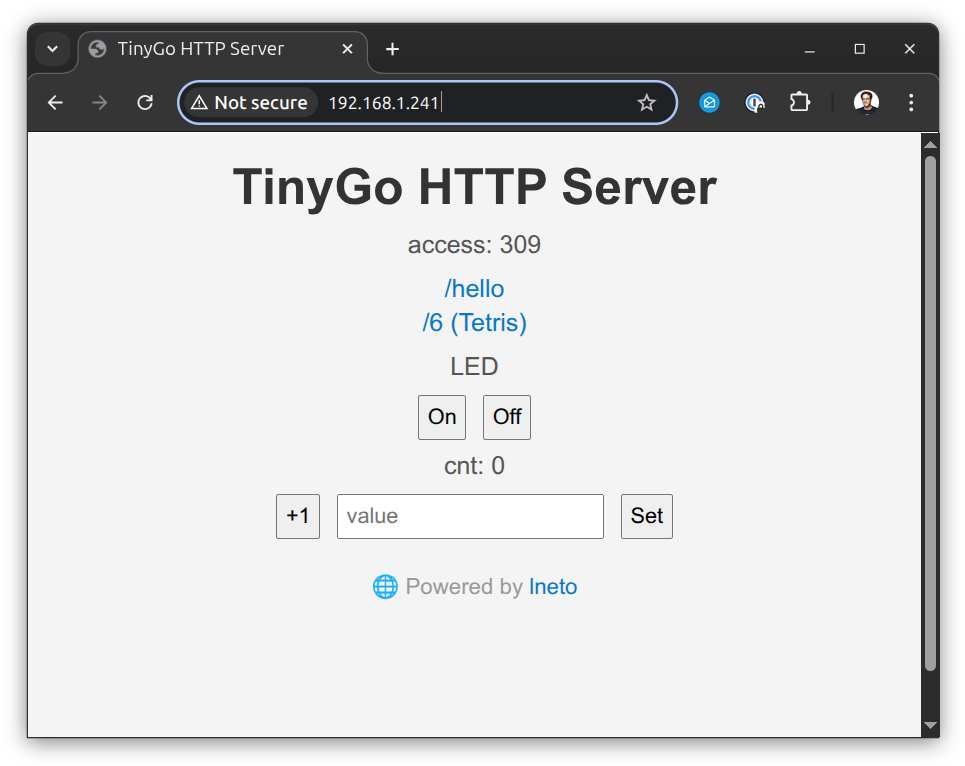
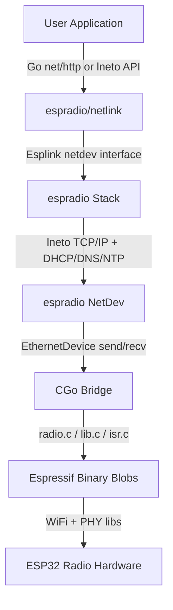

# espradio

[](https://pkg.go.dev/tinygo.org/x/espradio) [](https://github.com/tinygo-org/espradio/actions/workflows/build.yml)

[TinyGo](https://tinygo.org/) package for wireless communication on [Espressif](https://www.espressif.com/) ESP32xx microcontrollers.

Currently supports WiFi on the [`esp32c3`](https://www.espressif.com/en/products/socs/esp32-c3) single-core 32-bit RISC-V MCU and [`esp32s3`](https://www.espressif.com/en/products/socs/esp32-s3) dual-core XTensa LX7 MCU. Bluetooth is in progress, along with more processors.

### Features

- WiFi station (STA) and soft-AP modes
- WiFi scanning
- Go stdlib `net` support using the TinyGo `netdev`/`netlink` interface
- Pure-Go TCP/IP stack with DHCP, DNS, and NTP (uses [`lneto`](https://github.com/soypat/lneto))
- TCP and UDP Berkeley sockets API
- Raw Ethernet frame send/receive
- MQTT client support (uses [`natiu-mqtt`](https://github.com/soypat/natiu-mqtt))
- QEMU simulation target for ESP32-C3

## How to use

This code starts a basic webserver running on a [Seeed Studio XIAO-ESP32C3](https://www.seeedstudio.com/Seeed-XIAO-ESP32C3-p-5431.html) using `espradio` along with the Go stdlib `net/http` package:

```go
package main

import (
	"io"
	"log"
	"net/http"
	"time"

	"tinygo.org/x/drivers/netdev"
	nl "tinygo.org/x/drivers/netlink"
	link "tinygo.org/x/espradio/netlink"
)

var (
	ssid     string
	password string
	port     string = ":80"
)

func main() {
	// use ESP32 radio
	link := link.Esplink{}
	netdev.UseNetdev(&link)

	println("Connecting to WiFi...")
	err := link.NetConnect(&nl.ConnectParams{
		Ssid:       ssid,
		Passphrase: password,
	})
	if err != nil {
		log.Fatal(err)
	}

	println("Connected to WiFi.")

	// now setup the web server using the Go "net/http" package:
	http.HandleFunc("/", hello)

	h, _ := link.Addr()
	host := h.String()
	println("HTTP server listening on http://" + host + port)
	err = http.ListenAndServe(host+port, nil)
	for err != nil {
		println("error:", err.Error())
		time.Sleep(5 * time.Second)
	}
}

func hello(w http.ResponseWriter, r *http.Request) {
	println(r.Method, r.URL.Path)
	w.Header().Set(`Content-Type`, `text/plain; charset=UTF-8`)
	io.WriteString(w, "hello")
}
```

Flash it using TinyGo like this:

```
$ tinygo flash -target xiao-esp32s3 -ldflags="-X main.ssid=yourssid -X main.password=yourpassword" -size short -monitor ./examples/hello
   code    data     bss |   flash     ram
 860073   33552  345392 |  893625  378944
Connecting to /dev/ttyACM0...
Connected.      
Detected chip: ESP32-S3
...
```

Then you can test it by using `curl`:

```
$ curl -w "\n" http://192.168.1.241/
hello
```

## Features


## How it works

`espradio` uses the binary blobs provided by Espressif and calls them directly using TinyGo's built-in CGo support. This allows them to be fast and utilize the well-tested existing binaries for low level radio communication.

On top of that `espradio` then uses the [`lneto`](https://github.com/soypat/lneto) package, a pure Go layer 2 networking stack.

See the [architecture diagram](#architecture) for more details.

## Examples - `net` package calling `lneto`

### hello

Runs a minimal webserver using the Go `net/http` package using the `netlink` interface.

```
tinygo flash -target xiao-esp32s3 -ldflags="-X main.ssid=yourssid -X main.password=yourpassword" -size short -monitor ./examples/hello
```

### mqtt

Uses the MQTT machine to machine protocol to publish and subscribe to messages with the `broker.hivemq.com` test server. Uses the Go stdlib and the [`natiu-mqtt`](github.com/soypat/natiu-mqtt) package with the `netlink` interface.

```
$ tinygo flash -target xiao-esp32s3 -ldflags="-X main.ssid=yourssid -X main.password=yourpassword" -size short -monitor ./examples/mqtt/
   code    data     bss |   flash     ram
 672497   22956  284464 |  695453  307420
Connecting to /dev/ttyACM0...
Connected.
Detected chip: ESP32-S3
Loading stub loader...
Stub running.
Erasing entire flash...
Flash erased.
Attaching SPI flash...
Configuring flash size...
Auto-detected flash size: 8MB
Flash params set to 0x023F
SHA digest in image updated
Attaching SPI flash...
Compressed 695552 bytes to 472382 (68%)
Flash begin: 472382 bytes at 0x00000000 (29 compressed blocks)
[##################################################]  100.0%
Flash complete. Verifying...
MD5 verified: 468b20c64e138c8786f8b0b669a5d717

Device reset.
Connected to /dev/ttyACM0. Press Ctrl-C to exit.
load:0x4202db20,len:0x7c1b8
SHA-256 comparison failed:
Calculated: 716b35e13bffed22f2ce7fc865c81242c3bcf494fb3481bab12494585e0cfac9
Expected: 09eb25d79a2297f382faa0f8b842998881cd4a2474e9e80eb215799c7ddef1a6
Attempting to boot anyway...
entry 0x40386c8c
Connecting to WiFi...
Connected to WiFi.
ClientId: tinygo-client-WYVKRWBJRP
Connecting to MQTT broker at broker.hivemq.com:1883
TCP connected to 3.122.68.120:1883
Sending MQTT CONNECT...
MQTT CONNECT succeeded
Subscribed to topic cpu/usage
Message Random value: 34 received on topic cpu/usage
Message Random value: 8 received on topic cpu/usage
Message Random value: 32 received on topic cpu/usage
...
```

### webserver



Runs a webserver using the Go `net/http` package using the `netlink` interface:

```
$ tinygo flash -target xiao-esp32c3 -ldflags="-X main.ssid=yourssid -X main.password=yourpassword" -size short -monitor ./examples/webserver/
   code    data     bss |   flash     ram
 932780   34484  353934 |  967264  388418
Connecting to /dev/ttyACM0...                
Connected.                                                                                                
Detected chip: ESP32-C3
Loading stub loader...                                                                                                                                                                                              
Stub running.                                                                                             
Erasing entire flash...        
Flash erased.                      
Attaching SPI flash...                                                                                    
Configuring flash size...     
Auto-detected flash size: 4MB                                                                             
Flash params set to 0x022F              
SHA digest in image updated                                                                               
Attaching SPI flash...                                                                                    
Compressed 967360 bytes to 624318 (65%)                                                                   
Flash begin: 624318 bytes at 0x00000000 (39 compressed blocks)
[##################################################]  100.0%
Flash complete. Verifying...                                                                              
MD5 verified: 530da6d941a937d248fce4dbb88d420b                                                            
                                                                                                          
Device reset.                                      
Connected to /dev/ttyACM0. Press Ctrl-C to exit.                                                          
load:0x3fc8a7b0,len:0x86b4                                                                                
load:0x40392e64,len:0xa474                                                                                
load:0x4203905c,len:0xb3240
SHA-256 comparison failed:
Calculated: 698a9fd323776b909347315bd8e6dec519318ba17be4685ce367bea2464e5b27
Expected: a8fdd97c926ffa40023343a82e4366b1d7103db2214b1607bd34dac4225c78f7
Attempting to boot anyway...
entry 0x4039d294
Connecting to WiFi...
HTTP server listening on http://192.168.1.46:80
```

## Examples - `lneto` package only

### ap

Shows how to set up a WiFi access point with a DHCP server using the low-level lneto interface.

```
$ tinygo flash -target xiao-esp32c3 -ldflags="-X main.ssid=tinygoap -X main.password=YourPasswordHere" -monitor ./examples/ap
   code    data     bss |   flash     ram
 582004   21988  257010 |  603992  278998
Connected to ESP32-C3
Flashing: 604096/604096 bytes (100%)
Connected to /dev/ttyACM0. Press Ctrl-C to exit.
SHA-256 comparison failed:
Calculated: 8d1512da059d76b08bbfe99c14ab43d792466ee8fd85a365b338a6ad17aa1e2a
Expected: 06fd1290b7002c716ccf8a9df263fb33d5e22b6892e08038cb6a8e8f6b04be5f
Attempting to boot anyway...
entry 0x40398b3c
ap: enabling radio...
ap: starting AP...
ap: starting L2 netdev (AP)...
ap: creating lneto stack...
ap: configuring DHCP server...
ap: AP is running on 192.168.4.1 - connect to tinygo-ap
ap: rx_cb= 0 rx_drop= 0
ap: rx_cb= 0 rx_drop= 0
ap: rx_cb= 0 rx_drop= 0
...
```

### connect-and-dhcp

Connects to a Wi-Fi network and gets an IP address with DHCP using the low-level lneto interface.

```
$ tinygo flash -target xiao-esp32s3 -ldflags="-X main.ssid=yourssid -X main.password=YourPasswordHere" -monitor ./examples/connect-and-dhcp
   code    data     bss |   flash     ram
 574233   22304  259184 |  596537  281488
Connected to ESP32-S3
Flashing: 596640/596640 bytes (100%)
Connected to /dev/ttyACM0. Press Ctrl-C to exit.
SHA-256 comparison failed:
Calculated: 84318f99e1f97b458c8a4afc3237908a2d5be760b42c66b39c03367a96e2ae32
Expected: c3a26bf70f12f0ffc686e708a86b10548920a08e166a0b14d9e2a8f80e662d2e
Attempting to boot anyway...
entry 0x4038688c
initializing radio...
starting radio...
connecting to rems ...
connected to rems !
starting L2 netdev...
creating lneto stack...
starting DHCP...
got IP: 192.168.1.241
gateway: 192.168.1.1
DNS: 192.168.1.1
done!
alive
alive
...
```

### http-app

Connects to a WiFi access point, calls NTP to obtain the current date/time, then serves a tiny web application using the low-level lneto interface.

```
$ tinygo flash -target xiao-esp32c3 -ldflags="-X main.ssid=yourssid -X main.password=YourPasswordHere" -monitor ./examples/http-app/
Connected to ESP32-C3
Flashing: 652848/652848 bytes (100%)
Connected to /dev/ttyACM0. Press Ctrl-C to exit.
SHA-256 comparison failed:
Calculated: 5520848628102c249831cc101bbd042d6311260e697288fb5bf082ad4c912b32
Expected: 8b36e3d705b1ed66d74082f300d35a796d6153344e7e8b39eccdbaa2f0bff23f
Attempting to boot anyway...
entry 0x40395708
initializing radio...
starting radio...
connecting to rems ...
connected to rems !
starting L2 netdev...
creating lneto stack...
starting DHCP...
got IP: 192.168.1.46
resolving ntp host: pool.ntp.org
NTP success: 2026-03-21 08:51:31.136908291 +0000 UTC m=+3.079340401
listening on http://192.168.1.46:80
...
```

### http-static

Minimal HTTP server that serves a static webpage using the low-level lneto interface.

```
$ tinygo flash -target xiao-esp32c3 -ldflags="-X main.ssid=yourssid -X main.password=YourPasswordHere" -monitor 8kb ./examples/http-static/
Connected to ESP32-C3
Flashing: 627504/627504 bytes (100%)
Connected to /dev/ttyACM0. Press Ctrl-C to exit.
SHA-256 comparison failed:
Calculated: 468629c0cff3cf13345660532bcc748a1a93df46c197d51727d75863bd985195
Expected: 785df5a5bb20c057bcc0580b2870982aa779faeb1f946a5d3c371ad36da077f0
Attempting to boot anyway...
entry 0x40395350
initializing radio...
starting radio...
connecting to rems ...
connected to rems !
starting L2 netdev...
creating lneto stack...
listening on http://192.168.1.46:80
incoming connection: 192.168.1.223 from port 53636
incoming connection: 192.168.1.223 from port 53640
Got webpage request!
```

### scan

Scans for WiFi access points.

```
$ tinygo flash -target xiao-esp32c3 -monitor ./examples/scan
Connected to ESP32-C3
Flashing: 442736/442736 bytes (100%)
Connected to /dev/ttyACM0. Press Ctrl-C to exit.
SHA-256 comparison failed:
Calculated: 0045ab8467d485eb94005908a8e7f9dd7baf4dfa610f20ed67884c8ae5e98737
Expected: 6be1722a792dec8849a2a9fb26c8faf50ba48294ea6617e125472469e56ea719
Attempting to boot anyway...
entry 0x4038e3d0
initializing radio...
starting radio...
scanning WiFi...
AP: rems RSSI -59
AP: rems RSSI -78

scanning WiFi...
AP: rems RSSI -59
AP: rems RSSI -79
```

### starting

Starts the ESP32 radio.

## Architecture



- **User Application** - your code, using Go `net/http` or the `lneto` API directly.
- **espradio/netlink** - implements the TinyGo `netdev`/`netlink` interface so the Go stdlib `net` package works.
- **espradio Stack** - wraps the [`lneto`](https://github.com/soypat/lneto) pure-Go TCP/IP stack with DHCP, DNS, and NTP support.
- **espradio NetDev** - L2 Ethernet device that sends/receives raw frames to and from the radio.
- **CGo Bridge** - C shim code that translates between Go and the Espressif binary libraries.
- **Espressif Binary Blobs** - pre-compiled WiFi and PHY libraries provided by Espressif.
- **ESP32 Radio Hardware** - the on-chip 2.4 GHz radio peripheral.


## Updating `esp-wifi-sys`

This package uses files from the [`esp-wifi-sys`](https://github.com/esp-rs/esp-wifi-sys) package, then copies the needed ones into the `blobs` directory.

To update these dependencies to the latest version, run the `make update` command. This will update the submodule, then copy the needed files. Then run `make patch-esp32s3` to patch the blobs for the LLD linker. Note that this may break existing functionality requiring changes to TinyGo linker files or other changes.

## Debugging

- `netlinkdebug`: enables printing of netlink actions (webserver example)
- `pcapdebug`: enables logging of all packets sent and received (all examples)
```sh
tinygo flash -target=xiao-esp32c3 -tags=netlinkdebug,pcapdebug ./examples/webserver
```